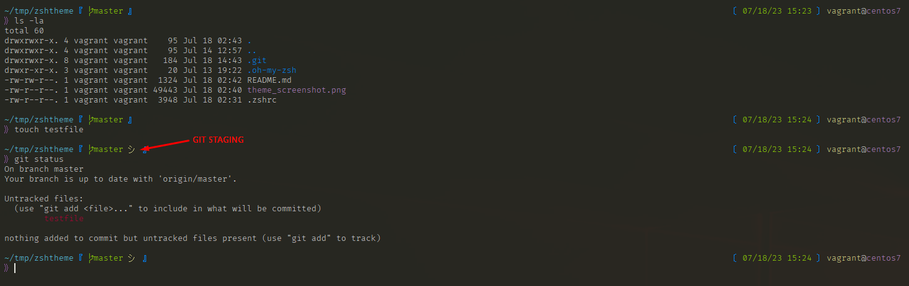

# Customized ZSH theme
Personally customized ZSH theme
>idea from: https://aamnah.com/sysadmin/zsh-custom-theme-ultimate-guide

### Prerequisites
- Install [oh-my-zsh](https://ohmyz.sh/#install)
```bash
# NOTE: git is required
# via curl
sh -c "$(curl -fsSL https://raw.githubusercontent.com/ohmyzsh/ohmyzsh/master/tools/install.sh)"
# via wget
sh -c "$(wget https://raw.githubusercontent.com/ohmyzsh/ohmyzsh/master/tools/install.sh -O -)"
```

### How to use
```bash
# 1) Change directory to oh-my-zsh custom themes
cd ~/.oh-my-zsh/custom/themes

# 2) Download theme rawfile
# via curl
curl -OL https://raw.githubusercontent.com/adrianne01/zshtheme/master/.oh-my-zsh/custom/themes/ayd.zsh-theme
# via wget
wget https://raw.githubusercontent.com/adrianne01/zshtheme/master/.oh-my-zsh/custom/themes/ayd.zsh-theme

# 3) Add custom dir to .zshrc
echo 'ZSH_CUSTOM="$ZSH/custom"' >> ~/.zshrc
# if $ZSH is not set
echo 'ZSH_CUSTOM="$HOME/.oh-my-zsh/custom"' >> ~/.zshrc

# 4) Update ZSH_THEME
sed -i -E 's/(ZSH_THEME=)".*"/\1"ayd"/' ~/.zshrc

# 5) Reload .zshrc
source ~/.zshrc
```
### Screenshot


### Themes referenced
- [af-magic](https://github.com/ohmyzsh/ohmyzsh/wiki/Themes#af-magic)
- [avit](https://github.com/ohmyzsh/ohmyzsh/wiki/Themes#avit)

